# Churn Analysis and Prediction 

## Project Overview
This project involves an in-depth analysis of customer churn within a telecom company, utilizing the Orange Telecom Churn Dataset from kaggle. The primary objective is to identify the key factors leading to customer churn and to develop a predictive model to accurately classify customers based on their likelihood to churn. The analysis and modeling efforts are supplemented with rich visualizations to provide actionable insights into customer behavior.

### Tools and Technologies
- **Alteryx Designer Cloud**: For data preparation, feature engineering, creating workflow. and building the predictive model.
- **Alteryx AutoML Cloud**: XGBoost-A machine learning algorithm used for the classification model in this project.
- **Tableau Public**: For creating dashboards and visualizations to analyze churn and present the model's findings.

## Data Preparation
### Dataset Overview
The dataset used for this project includes 2666 rows (customers) and 20 columns (features) each. These attributes include customer demographics, account information, usage metrics, and a binary target variable indicating whether the customer has churned.

### Key Attributes
- **State**: The US state in which the customer resides.
- **Account Length**: The duration (in months) that a customer has been with the telecom provider.
- **Area Code**: The area code of the customer.
- **International Plan**: Binary indicator of whether the customer has an international calling plan.
- **Voice Mail Plan**: Binary indicator of whether the customer has a voicemail plan.
- **Number of Customer Service Calls**: The number of calls made by the customer to customer service.
- **Total Day, Eve, Night, Intl Minutes**: The number of minutes the customer has used during the day, evening, night, and international calls.
- **Total Day, Eve, Night, Intl Charges**: The total charges incurred by the customer for day, evening, night, and international calls.
- **Churn**: Binary target variable where 1 indicates the customer churned and 0 indicates they did not.

### Alteryx Designer Cloud - Data Cleaning and Feature Engineering
1. **Data Cleaning**:
   - Handled missing values and ensured consistency in data types across all attributes.
   - Removed any obvious outliers that could skew the model's predictions.

2. **Feature Engineering**:
   - **Derived Features**: Created new features by normalizing usage metrics (e.g., `DayChargePerMinute`, `EveChargePerMinute`, `NightChargePerMinute`, `IntChargePerMinute`) to enhance the model's ability to predict churn.
   

### Data Splitting
- The dataset was split into two subsets using an 70-30 ratio using random sampling which can be seen through the workflow. Joins and unions as well as formulas and filters were used in order to achieve this:
  - **Training Set**: Used for model training and cross-validation.
  - **Test Set**: Reserved for final model evaluation and to assess its performance on unseen data.

Both the datasets can be found in [Alteryx Desinger Cloud Folder](AlteryxDesignerCloud).

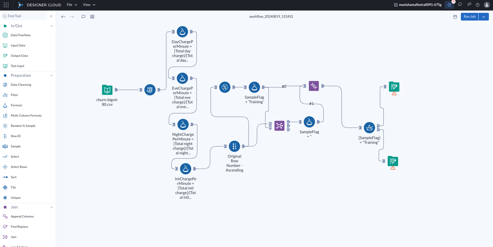
  

## Exploratory Data Analysis (EDA) in Tableau Public
### Churn Rate Analysis
- **Overall Churn Rate**: The dataset revealed that approximately 14.5% of customers had churned, indicating a relatively high churn rate.

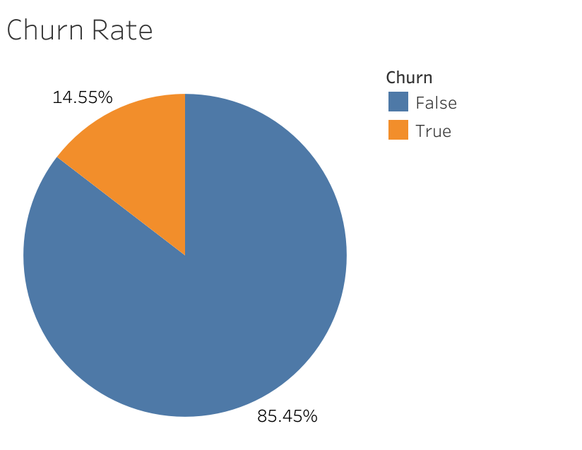

- **State-wise Churn Rate**:
  - **Top States**: Certain states exhibited significantly higher churn rates such as Texas, New Jersey and California.
  - **Insights**: States with higher churn rates often correlated with higher customer service call frequencies and larger customer bases, indicating potential service quality issues.

### Customer Service Calls vs. Churn Rate
- **Correlation**: A strong positive correlation was observed between the number of customer service calls and the likelihood of churn. Customers who made more than 3 calls were significantly more likely to churn.
- **Insight**: This suggests that customers who are dissatisfied with service or facing recurring issues are more prone to churn, highlighting the importance of first-call resolution.

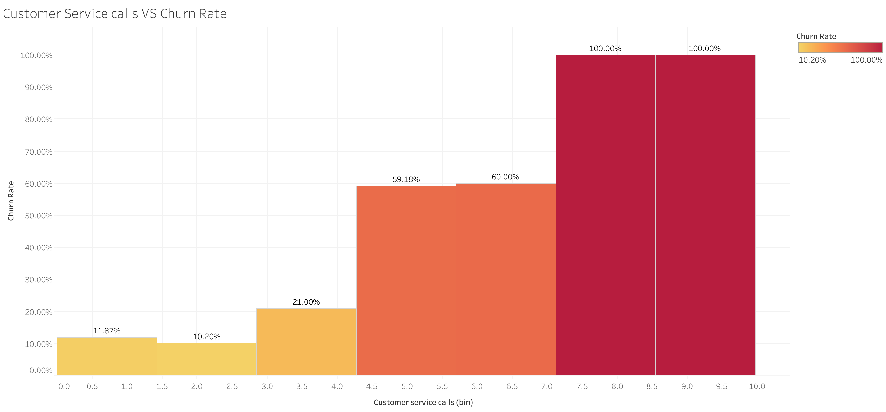

### International Plan vs. Churn Rate
- **Observation**: Customers with an international plan had a higher churn rate compared to those without. 
- **Insight**: This could indicate that the international plan may not be meeting customer expectations or that international callers are more price-sensitive and thus more likely to switch providers.

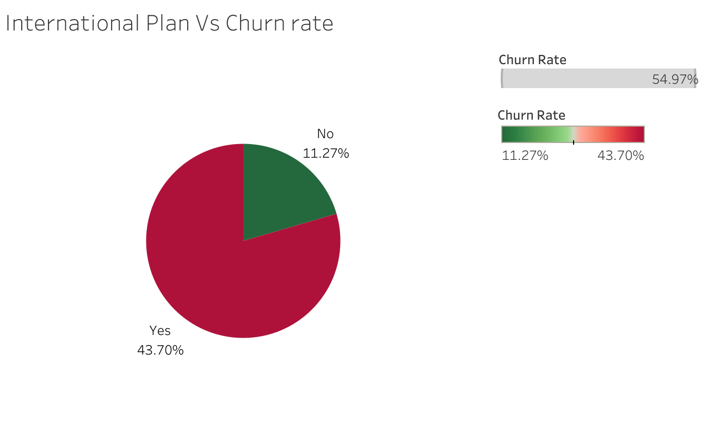

### Charges vs. Churn Rate
- **Day Charges**: Higher day charges correlated with a higher likelihood of churn, suggesting that customers who incur higher costs during peak hours may be more price-sensitive.
- **Night Charges**: Interestingly, higher night charges correlated with lower churn rates, possibly indicating that customers who utilize off-peak hours may find the service more valuable.
- **International Charges**: Higher international charges showed a strong correlation with churn, reinforcing the idea that international customers are more likely to leave if they perceive the service as too costly.

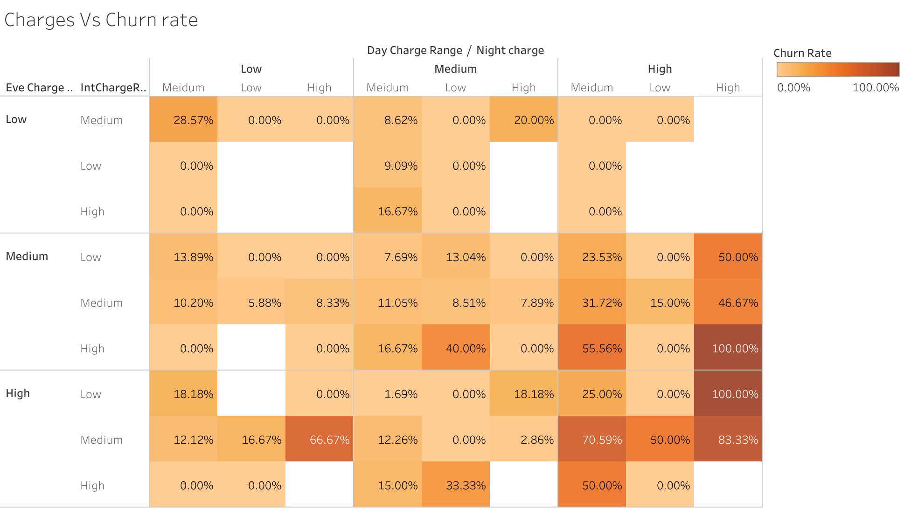

All these Tableau workbooks are [here](TableauEDAworkbooks) and you can also check them on my [Tableau Public](https://public.tableau.com/app/profile/manisha.malhotra4221/vizzes)

## Alteryx Predictive Modeling
### Model Selection and Training
- **Algorithm**: Alteryx suggested XGBoost, a gradient boosting decision tree algorithm, was chosen for its robustness and high performance in tasks which are binary in nature.
- **Training**: The model was trained on the `training` [dataset](AlteryxDesignerCloud/Training.csv) which was created though Alteryx designer cloud.

### Model Evaluation
The Alteryx AutoML provided a [PPT](AlteryxMachineLearningModel) which has the ROC curve, Confusion Matrix and the key features and its importance auto calculated the model.

- **ROC Curve**: The ROC curve for the model indicated an area under the curve of 0.93, signifying a high true positive rate with minimal false positives.
  
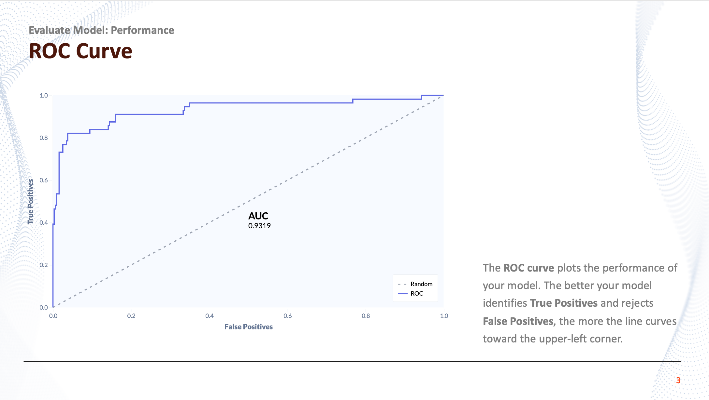

- **Confusion Matrix**:
  - **True Positives**: The model correctly identified 87% of the churned customers.
  - **False Positives**: The model incorrectly labeled 5% of non-churned customers as churned, which is within an acceptable range for this type of predictive modeling.

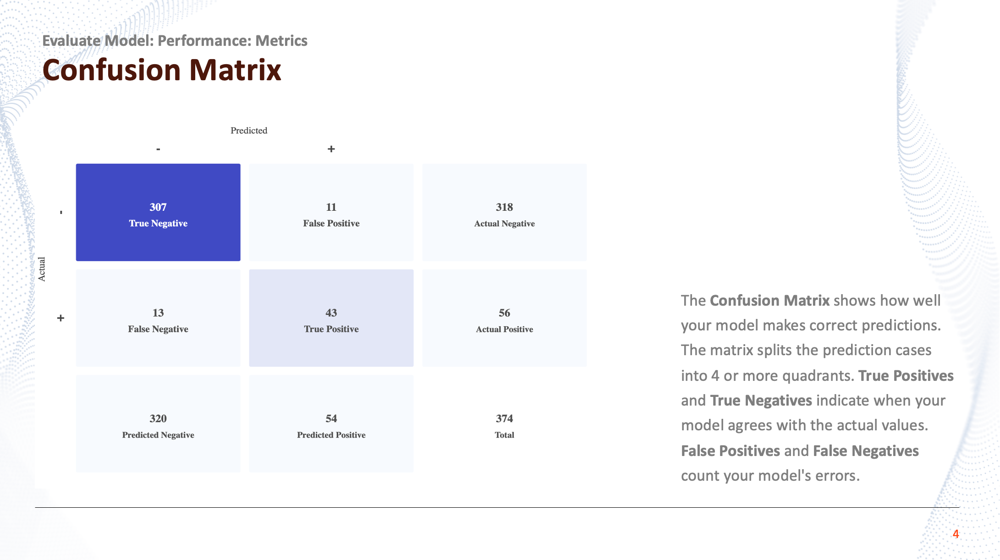

- **Feature Importance**:
  - **Top Features**: Total day charge, customer service calls, and international plan were among the top features influencing the model's predictions.
  - **Insights**: These features highlight the importance of customer usage patterns and service satisfaction in predicting churn.
 
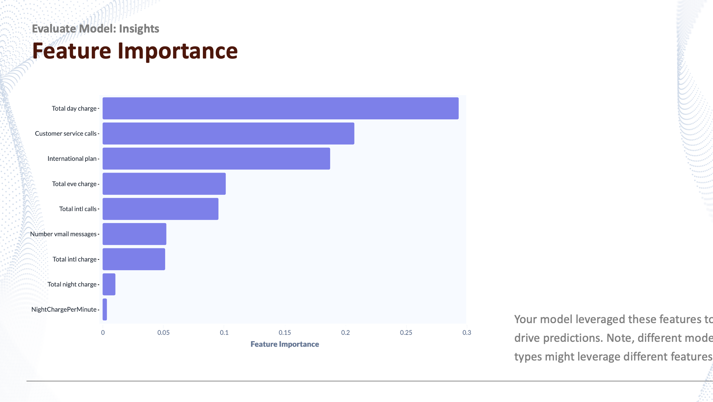

THE MODEL EVALUATION PART OF THE PROJECT WITH ITS ROC, CONFUSION MATRIX AND FEATURE IMPORTANCE GRAPHS AS WELL AS INSIGHTS ARE PROVIDED BY ALTERYX AUTOML.

### Tableau Prediction Analysis

Using the Alteryx AutoML evaluation and information gathered such as feature importance I did futher analysis for the predicted data by the model in tableau. Link to the [predicted data](AlteryxMachineLearningModel/predicted_data.csv)

- **Probability Distribution**:
  - The overlapping histogram with more data towards the edges indicate that the probabilities predicted give us definative results.

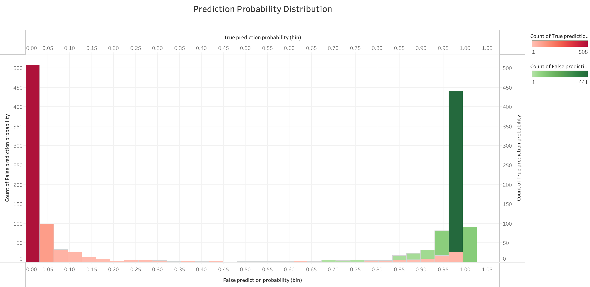

- **High-Risk Segments**: High risk segments such as customer service calls and international plan from different states effects the median prediction probabilities of churn.

 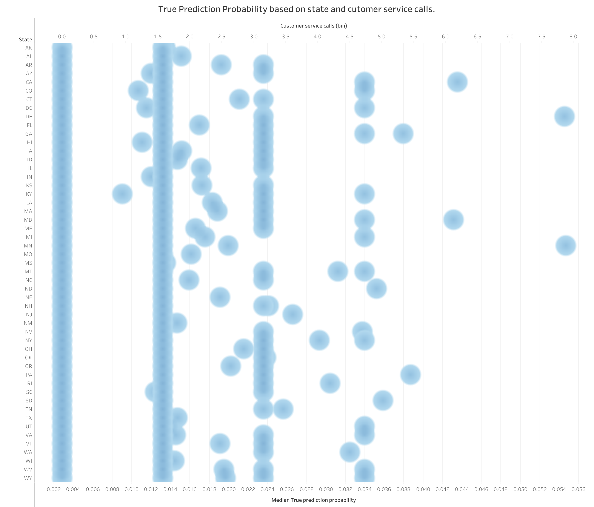  

- **Actual and predicted Churn**: Analyzed actual and predicted chun which has less values in the middle indicating good modelling.

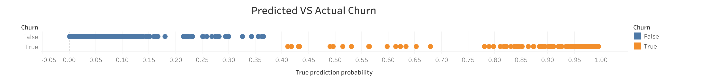  

## Tableau Dashboards
1. **Churn Analysis Dashboard**:
   - **State-wise Churn Visualization**: Interactive maps showing churn distribution across states, with filters to explore the impact of different features.
   - **Service Calls vs. Churn**: A bar chart correlating the number of customer service calls with churn rates, providing clear visual evidence of the relationship.
   - **Charge Analysis**: A heatgraph showing the relationship between various charges (day, evening, night, international) and churn rates.
   - **International Plan Analysis**: A comparative analysis of churn rates between customers with and without international plans with a pie chart.
  
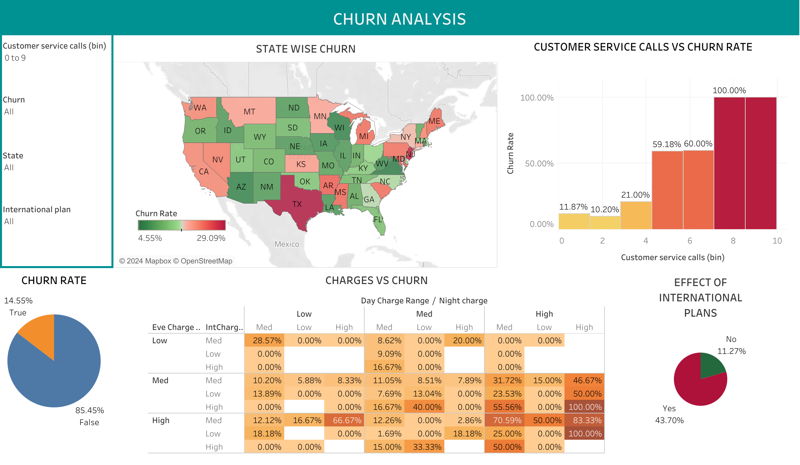

For more interactive dashboard goto [Link](https://public.tableau.com/app/profile/manisha.malhotra4221/viz/ChurnanalysisDashboard/ChurnAnalysis)
  
2. **Prediction Dashboard**:
   - **Probability Distribution**: A overlapping histogram of churn prediction probabilities.
   - **Customer Segmentation**: Clustered visualizations of customer segments based on their predicted churn risk, providing actionable insights for targeted retention strategies.
  
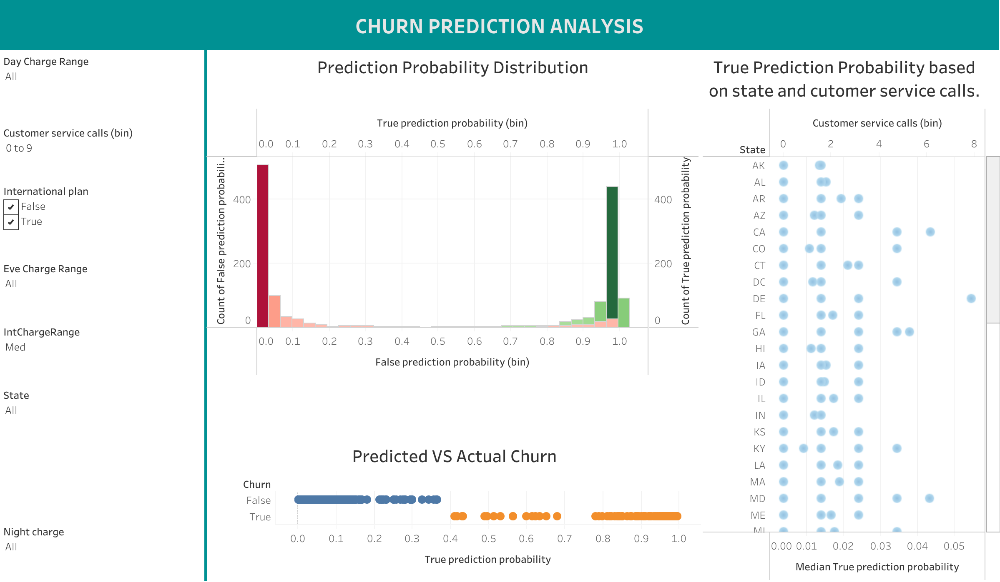

For more interactive dashboard goto [Link](https://public.tableau.com/app/profile/manisha.malhotra4221/viz/ChurnPredictionanalysisDashboard/ChurnPredictionAnalysis)

## Key Insights and Recommendations
### Insights
- **High Churn in High Usage Customers**: Customers with high day charges and frequent service calls are at a higher risk of churn, indicating dissatisfaction potentially due to billing or service issues.
- **Regional Variations**: Certain states with higher churn rates may require localized customer retention strategies.
- **International Plan Sensitivity**: Customers with international plans are more likely to churn, suggesting a need to reevaluate the pricing or quality of international services.

### Recommendations
1. **Improve Customer Service**: Focus on reducing the number of customer service calls by enhancing first-call resolution and proactively addressing common issues.
2. **Reassess International Plan Offerings**: Consider revising international plans to make them more competitive and aligned with customer expectations.
3. **Targeted Retention Strategies**: Use the model's predictions to identify high-risk customers and implement targeted retention campaigns, such as personalized offers or discounts for heavy day-time users.

## Conclusion
The project successfully identified key drivers of customer churn and built a predictive model with strong performance metrics using Alteryx autoML. The insights derived from the data and the model can be leveraged to implement effective churn reduction strategies, potentially leading to significant cost savings and improved customer satisfaction craeted using Tableau Public.
